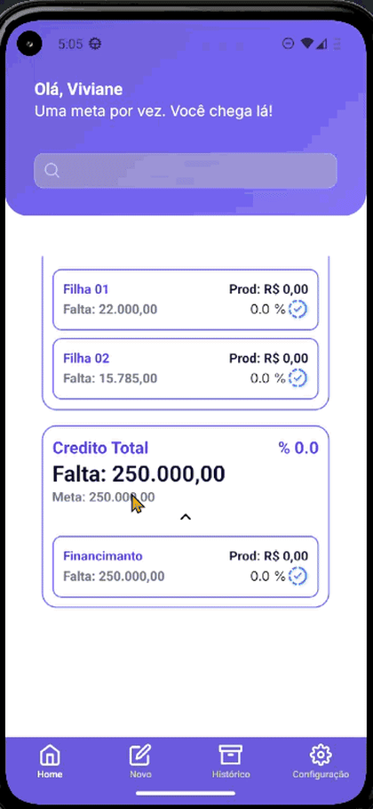
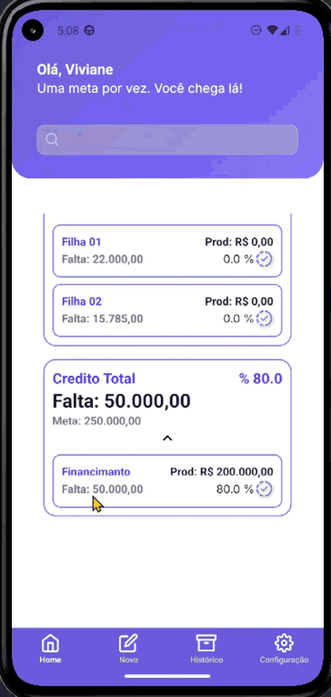

# 📱 Metamais – Gestão de Metas por Produto
**Metamais** é um aplicativo mobile desenvolvido em React Native com foco em profissionais em qualquer ramo de atuação que desejam acompanhar o desempenho diário em relação às metas de produtos.
Permite registrar produção, acompanhar percentuais atingidos e identificar rapidamente produtos que precisam de mais foco.

## 🚀 Funcionalidades
- Cadastro de Produtos com nome, segmento e possibilidade de metas-filhas.
- Registro de Produção Diária com cálculo automático do percentual atingido.
- Visão Geral das metas: exibição por produto e destaque dos produtos não atingidos.
- Histórico para acompanhamento de desempenho ao longo do tempo. ( Em construção )
- Interface leve, responsiva e com excelente usabilidade
- Armazenamento local com AsyncStorage

## 🧱 Tecnologias Utilizadas
- Frontend: React Native (Expo)
- Arquitetura: MMVC
- Persistência local: AsyncStorage
- React Navigation
- StyleSheet
- Icons

## 📺 Demonstração – v1.0

> **Nota:** Todos os dados apresentados nas demonstrações são fictícios, criados exclusivamente para fins de teste e ilustração, sem qualquer relação com instituições financeiras reais.

  
  
  
  

  Cadastro de Produto &nbsp;|&nbsp; Cadastro de Produção &nbsp;|&nbsp; Exclusão de Produto &nbsp;|&nbsp; Alterando Tema

## 📁 Estrutura do Projeto

.
├─ assets/ # Imagens, fontes, ícones, etc.
├─ src/
│ ├─ components/ 
│ ├─ context/ 
│ ├─ controllers/ 
│ ├─ docs/ 
│ ├─ models/ 
│ ├─ routes/ 
│ ├─ utils/
│ └─ views/ 
│ ├─ History/
│ ├─ Home/
│ ├─ NewProduct/
│ └─ Settings/
├─ .expo/ 
├─ App.tsx 
├─ index.ts 
└─ README.md        

👩‍💼 Idealizadora
Projeto idealizado por uma funcionária do setor bancário com apoio técnico e desenvolvimento por Viviane Araújo como parte da disciplina extensionista Programação para Dispositivos Móveis em Android.
